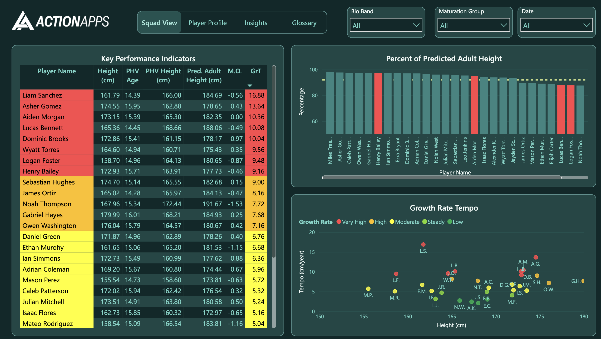
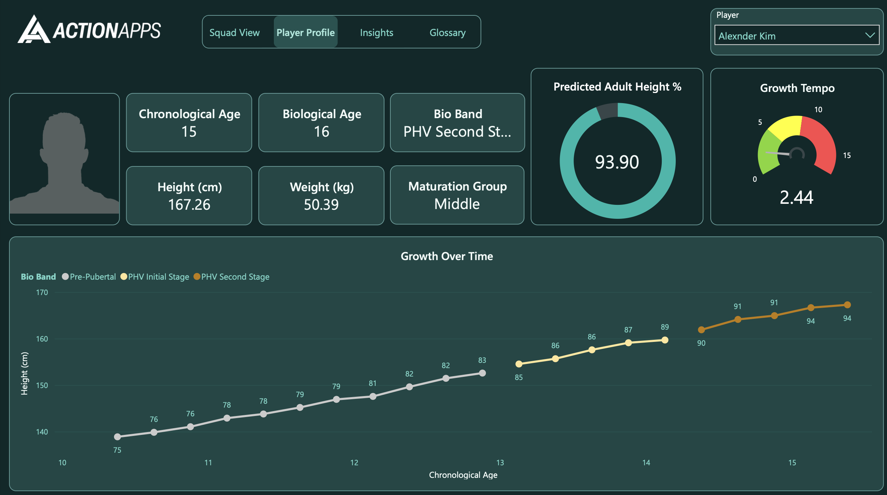
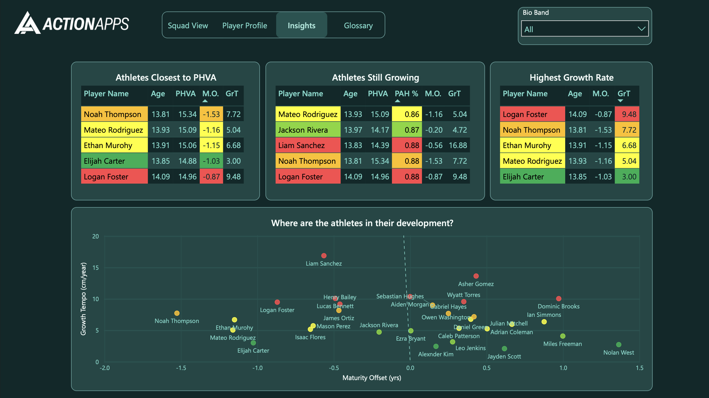
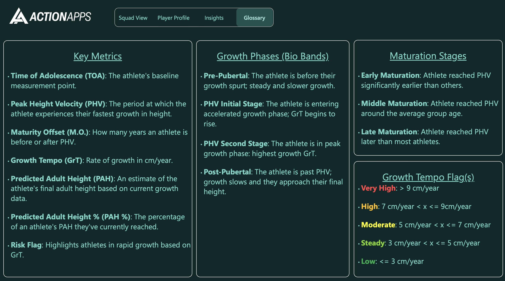

# Growth & Maturation Dashboard

## Project Overview

This project was developed during my internship at Action Apps, a sports technology company looking to expand its suite of athlete monitoring products.

The objective was to build a client-facing Power BI dashboard that tracks growth and maturation in adolescent athletes, enabling professional football clubs to monitor athlete development and support individualized training strategies.

Because a reliable dataset did not exist, I collaborated with sports scientists and conducted extensive domain research to create a realistic synthetic dataset from scratch.

This project showcases stakeholder collaboration, synthetic data creation, and dashboard development to solve a real-world sports analytics problem.

---

## Business Problem

Growth and maturation occur at different rates for every young athlete. Understanding these differences is essential for tailoring training programs, managing workloads, and maximizing long-term athletic development.

A major challenge, however, was the absence of a reliable dataset that could be used to develop and demonstrate the product to prospective clients.

To address this challenge, I researched adolescent maturation, identified the most relevant growth metrics, and collaborated with sports scientists to develop realistic athlete profiles and scientifically grounded data that could be used to build a client-ready dashboard.

---

## My Role

I led the project from concept to dashboard deployment, including:

* Conducted research on adolescent maturation and athlete development
* Identified and defined key performance indicators (KPIs)
* Collaborated with sports scientists to validate calculations and realistic ranges
* Created a synthetic dataset from scratch
* Designed the dashboard layout and user experience
* Built interactive Power BI visualizations
* Developed conditional formatting systems to highlight athlete development trends

---

## Dataset Summary

* 30 synthetic athletes
* 600 total records
* Data collected every 3 months over a 60-month period
* Three maturation groups:

  * Early maturers
  * Middle maturers
  * Late maturers

---

## Key Metrics

* Height (cm)
* Peak Height Velocity Age (PHVA Age)
* Peak Height Velocity Height (PHVA Height)
* Predicted Adult Height (cm)
* Maturity Offset
* Growth Tempo

---

## Dashboard Features

### Squad View

Provides a team-level overview of athlete development and allows users to compare KPIs across athletes using Bio Band, Maturation Group, and Date filters.



---

### Player Profile

Provides an individualized view of athlete development over time, including growth trajectories, predicted adult height, and growth tempo.



---

### Insights

Highlights athletes that may require additional monitoring by identifying those closest to Peak Height Velocity Age, those still developing, and those experiencing the fastest growth rates.



---

### Glossary

Defines key growth and maturation concepts, KPI calculations, and the growth tempo classification system.



---

## Tools Used

* Excel
* Power BI
* DAX
* Data Modeling
* Data Visualization
* Sports Analytics
* Sports Science Research
* Stakeholder Collaboration

---

## Key Takeaways

This project highlights the ability to:

* Translate domain knowledge into a data-driven product
* Work through ambiguous business requirements
* Collaborate effectively with subject matter experts
* Create realistic synthetic datasets when data is unavailable
* Design interactive dashboards that support decision-making

---

## Repository Contents

```text
growth-maturation-dashboard/

README.md
methodology.md

data/
└── synthetic_growth_maturation_dataset.csv

dashboard/
└── growth_maturation_dashboard.pbix

visuals/
├── squad_view.png
├── player_profile.png
├── insights.png
└── glossary.png
```

---

## External Review

This dashboard was publicly reviewed by sports scientist Jo Clubb, who discussed its approach to tracking growth and maturation in adolescent athletes.

🎥 Watch the YouTube review:
https://www.youtube.com/watch?v=telx9AMyHq4

---

## Author

Samuel Gonzalez

M.S. in Data Science | Sports Analytics | Data Visualization | Business Intelligence

LinkedIn: [Samuel Gonzalez](https://www.linkedin.com/in/samuel-gonzalez-87512b211/)

GitHub: [samuelgonzalez4](https://github.com/samuelgonzalez4)

